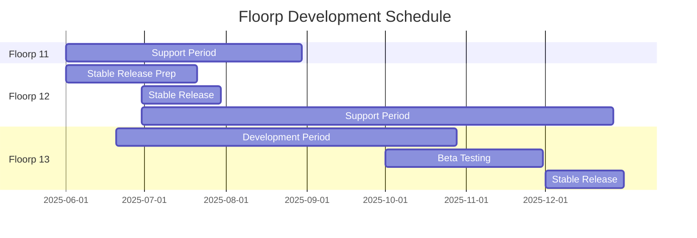

# Project Roadmap

import Tabs from '@theme/Tabs';
import TabItem from '@theme/TabItem';

## Development Schedule Overview

---

# Floorp Browser Roadmap

:::info
This roadmap outlines our development plans, which may change based on circumstances.
For the latest information, please visit our [official website](https://floorp.app) and [official blog](https://blog.floorp.app).
:::

## 2025 Q2

### Floorp 12 Stable Release
- Improved stability based on user testing
- Ongoing bug fixes and performance improvements
- Stabilization of new features

### Experimental Implementation of Floorp OS (AI Integration)
- Opt-in AI features using local LLM
- Desktop application integration
- Detailed specification documentation

### Addition of New Update Channel "Beta"
- More stable versions than Daylight channel
- Enabling gradual feature releases

## 2025 Q3

### Floorp OS (AI Integration) Beta Release
- Start of experimental feature rollout
- Collection of user feedback
- Gradual feature expansion

## 2025 Q4

### Floorp 13 Stable Release
- Quality improvements based on user testing
- Stabilization of new features
- Performance optimization

### Floorp OS (AI Integration) Stable Release
- Official provision in opt-in format
- Improvements based on user feedback
- Feature enhancement

## Future Outlook for 2026 and Beyond

### Sync Feature Enhancement
- Expansion of synchronizable data types
- Cross-platform sync optimization
- Enchanced privacy protection

### DRM Support Implementation
- Implementation of DRM (Digital Rights Management) support
- Full support for streaming services
- Security assurance

### Mobile Deployment Preparation
- Mobile version development planning
- Platform selection
- Development roadmap creation

:::info
Please share your opinions and requests via [GitHub Issues](https://github.com/Floorp-Projects/Floorp/issues).
:::
