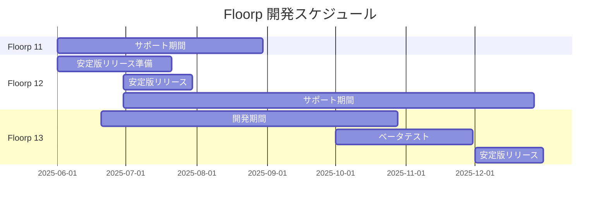

# プロジェクトロードマップ

## 開発スケジュール概要

---

# Floorp ブラウザー ロードマップ

:::info
このロードマップは開発予定であり、状況に応じて変更される可能性があります。
最新情報は[公式ウェブサイト](https://floorp.app)と[公式ブログ](https://blog.floorp.app)でご確認いただけます。
:::

## 2025年 Q2

### Floorp 12 安定版リリース
- ユーザーテストに基づく安定性の向上
- バグ修正とパフォーマンス改善の継続
- 新機能の安定化

### Floorp OS（AI統合）の実験的実装
- ローカルLLMを活用したオプトイン型AI機能
- デスクトップアプリケーション連携機能の実装
- 詳細仕様のブログ公開

### 新アップデートチャンネル「Beta」の追加
- Daylightチャンネルより安定したバージョンの提供
- 段階的な機能リリースの実現

## 2025年 Q3

### Floorp OS（AI統合）のベータ版リリース
- 試験的な機能提供の開始
- ユーザーフィードバックの収集
- 段階的な機能拡張

## 2025年 Q4

### Floorp 13 安定版リリース
- ユーザーテストに基づく品質向上
- 新機能の安定化
- パフォーマンス最適化

### Floorp OS（AI統合）の安定版リリース
- オプトイン形式での正式提供開始
- ユーザーフィードバックに基づく改善
- 機能の拡充

## 2026年以降の展望

### 同期機能の強化
- 同期可能なデータ種類の拡張
- クロスプラットフォーム同期の最適化
- プライバシー保護の強化

### DRM対応の実現
- コンテンツ保護技術の実装
- ストリーミングサービスの完全対応
- セキュリティの確保

### モバイル展開の準備
- モバイル版の開発計画策定
- プラットフォーム選定
- 開発ロードマップの作成

:::info
ご意見・ご要望は[GitHub Issues](https://github.com/Floorp-Projects/Floorp/issues)までお寄せください。
:::
