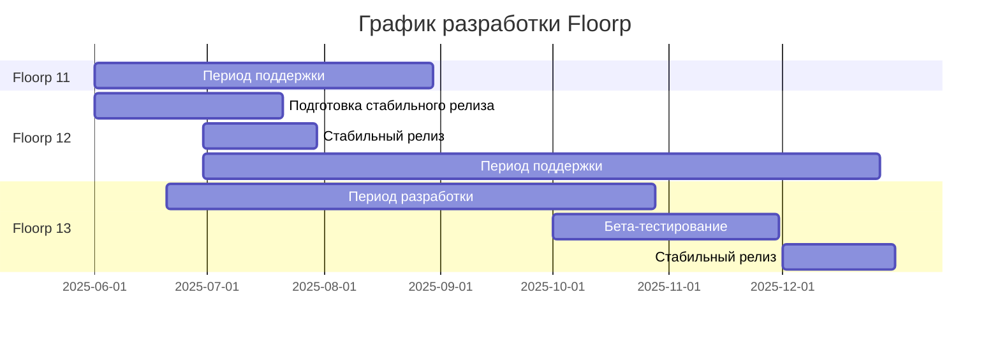

import Tabs from '@theme/Tabs';
import TabItem from '@theme/TabItem';

## График разработки

---

# Дорожная карта Floorp

:::info
Эта дорожная карта описывает наши планы разработки, которые могут изменяться в зависимости от обстоятельств.
Для получения актуальной информации посетите наш [официальный сайт](https://floorp.app) и [официальный блог](https://blog.floorp.app).
:::

:::info
Floorp OS переводится как "Floorp Operating Software" и на начальных этапах представляет собой интеграцию ИИ в Floorp. 
:::

## 2025 Q2 (Второй квартал)

### Стабильный релиз Floorp 12
- Повышенная стабильность на основе тестирования пользователями
- Постоянные исправления ошибок и улучшения производительности
- Стабилизация нового функционала

### Экспериментальная реализация Floorp OS (интеграция ИИ)
- Внедрение опциональных функционала ИИ с использованием локальных языковых моделей (LLM)
- Интеграция с десктопными приложениями
- Создание документации спецификаций

### Добавление нового канала обновлений "Beta"
- Более стабильные версии по сравнению с каналом Daylight (Alpha)

## 2025 Q3 (Третий квартал)

### Бета-релиз Floorp OS
- Начало экспериментального внедрения функций
- Сбор отзывов пользователей
- Постепенное расширение функционала

## 2025 Q4 (Четвертый квартал)

### Стабильный релиз Floorp 13
- Общие улучшения качества на основе отзывов пользователей
- Стабилизация нового функционала
- Оптимизация производительности

### Стабильный релиз Floorp OS
- Официальное предоставление в опциональном формате
- Улучшения на основе отзывов пользователей
- Расширение функционала

## Перспективы на 2026 год и далее

### Улучшение синхронизации
- Расширение типов синхронизируемых данных
- Оптимизация кросс-платформенной синхронизации
- Усиленная защита приватности

### Внедрение поддержки DRM
- Полная совместимость со стриминговыми сервисами

### Подготовка мобильной версии
- Планирование разработки мобильной версии
- Выбор платформ
- Создание дорожной карты разработки

:::info
Пожалуйста, делитесь вашим мнением и запросами через [GitHub Issues](https://github.com/Floorp-Projects/Floorp/issues).
:::
